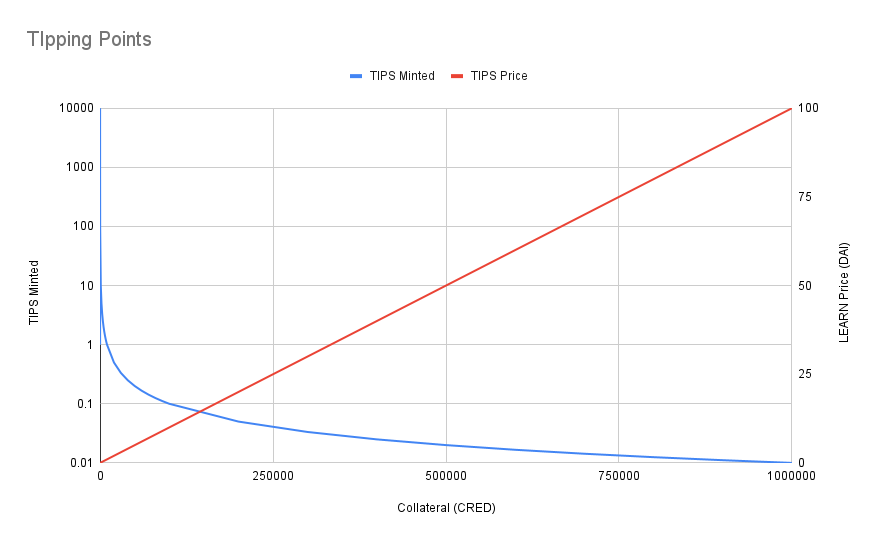

# TIPS

Send your frens tips on `ao`, via twitter.

This repo hosts the code required to enact [this request from Sam Williams](https://twitter.com/samecwilliams/status/1776286811280560270).

## Token Info

Sending tips to your friends requires that you first get some TIPS tokens. 

1. You can buy TIPS with CRED.
2. You can sell your TIPS for CRED.
3. As more CRED is used to mint TIPS, each TIP becomes more valuable.
4. As TIPS are burnt to redeem the underlying CRED, each TIP becomes less valuable.
5. This effect is achieved by using [the same curve defined here](https://www.kernel.community/en/tokens/token-studies/free-learn/spec/#learning-curve). It looks like this:



## Getting TIPS

1. [`aos`](https://cookbook_ao.g8way.io/welcome/getting-started.html).
2. Get some CRED, which you can do by completing [`ao` quests](https://cookbook_ao.g8way.io/tutorials/begin/index.html).
3. Use these commands in your interactive `aos` console:

```bash
TIPS = "V6j-w8aJwgb10ke8h6OwshyUGh5YmvJJHfDXB-jlYvY" # the TIPs Process ID
Send({Target=CRED,Action="Transfer",Recipient=TIPS,Quantity="1000"}) # to buy TIPS with CRED
Send({Target=TIPS,Action="Transfer",Recipient=<whomever>,Quantity="1000"}) # to transfer TIPS
Send({Target=TIPS,Action="Sell",Quantity="100"}) # to burn TIPS and redeem CRED
```

## Twitter Integration

Coming soon (TM)